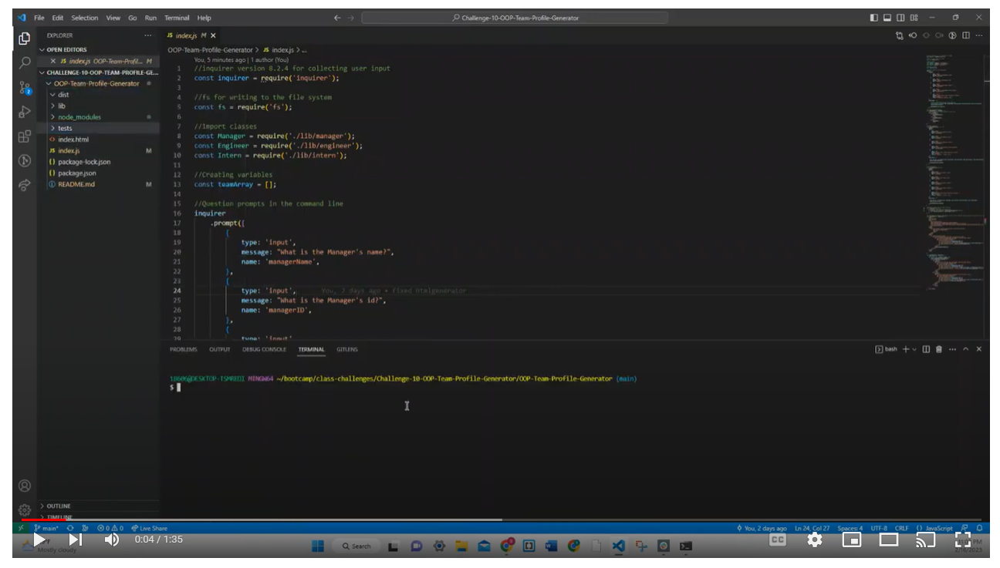
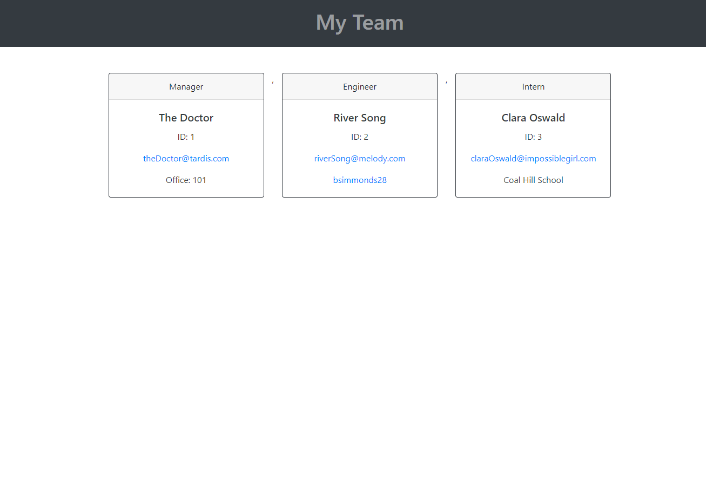

# Team Profile Generator

## Description
This application takes in information about employees on a software engineering team and then generates an HTML webpage that displays summaries for each person.

Click the image below to see a demo of the application.

The following image shows the web application's appearance.

## Table of Contents
- [Description](#description)
- [Installation](#installation)
- [Usage](#usage)
- [Contributing](#contributing)
- [Questions](#questions)

## Installation
In order to install inquirer, please use:  
npm i inquirer@8.2.4

In order to install and run Jest, please use:  
npm i jest  
npm install --save-dev jest  
npm run test  

## Usage
As a manager, I WANT to generate a webpage that displays my team's basic info SO THAT I have quick access to their emails and GitHub profiles.

The application will be invoked by using the following command: 
node index.js

## Contributing
Thank you for your interest in my project. I am excited to see your contributions. Please follow the [Contributor Covenant](https://www.contributor-covenant.org/).

## Questions
If you have additional questions, please email me at bsimmonds28@gmail.com.
To see more of my work, find me on GitHub at [bsimmonds28](https://github.com/bsimmonds28)!